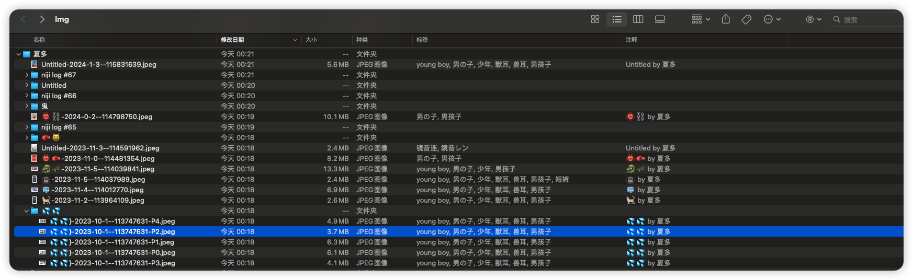

# pixiv downloader

## 使用说明

**只在 MAC 平台开发,其他平台均未测试**

> 如果想要保存照片的作者、标签和描述,请先使用 `brew install tag` 和 `sudo cp /opt/homebrew/bin/tag /usr/local/bin`

使用前添加  `.env` 文件

```
USERNAME=***
PASSWORD=***
DOWNLOADLOCATION=***
```

分别填入用户名,密码,下载位置

### 效果

