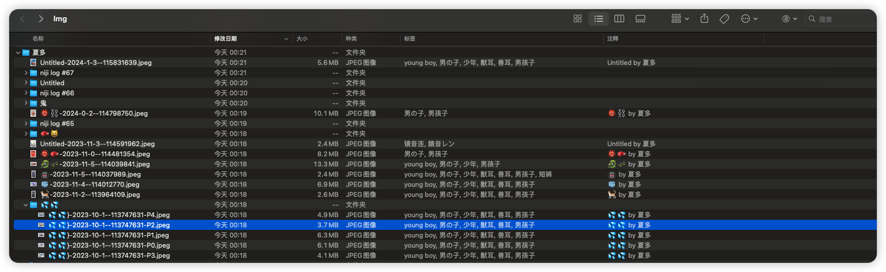

# pixiv downloader

## 使用说明

**只在 MAC 平台开发,其他平台均未测试**

> 如果想要保存照片的作者、标签和描述,请先使用下面命令
> 1. `brew install tag` 
> 2. `sudo cp /opt/homebrew/bin/tag /usr/local/bin`

### 注意
使用前添加  `.env` 文件

```
USERNAME=***
PASSWORD=***
DOWNLOADLOCATION=***
```

分别填入用户名,密码,下载位置

### QA

#### 运行错误

如果完成上面的内容但是运行错误的,尝试把账号登陆完成的cookie存入 pixiv.db account表的ciikie字段中,并填写账号id.

#### 报找不对应版本的chorme

运行 `pnpx puppeteer browsers install chrome`


### 效果

